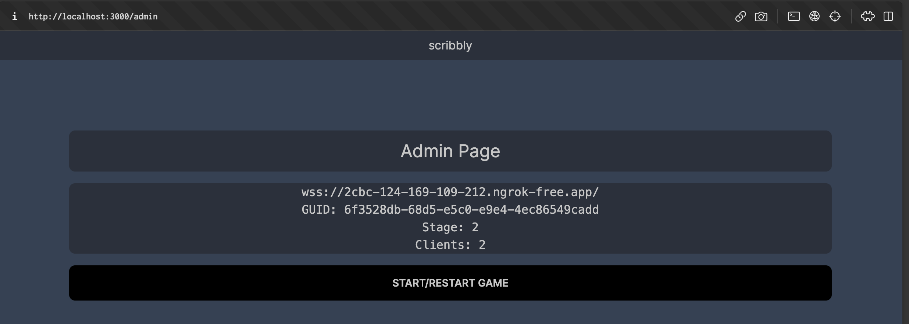

# scribbly
     

This is the codebase of a websockets and ML focused project made as a part of the [2023 Code Network Winter Hackathon](https://www.eventbrite.com.au/e/code-network-winter-hackathon-2023-tickets-656620267897) hosted by Code Network. The theme of the hackathon was **build anything as long as its awesome**, with our project being used as an opportunity for us to implement ML into a NextJS project.

This application is a [skribblio](https://skribbl.io/)/[QuickDraw](https://quickdraw.withgoogle.com/) clone built with websockets to make it a 1v1 as well as allow for audience live spectating and voting. 

## Stack
- [NextJS 13](https://nextjs.org/) with app router was our chosen ReactJS front-end framework, using [TailwindCSS](https://tailwindcss.com/) with [DaisyUI](https://daisyui.com/) as a plugin for styles. Used [Jotai](https://jotai.org/) for global state management.
- [Rust](https://www.rust-lang.org/), using [tokio](https://github.com/tokio-rs/tokio) and [tungstenite](https://github.com/snapview/tungstenite-rs)
- [Bebop](https://github.com/betwixt-labs/bebop) typesafe binary serialisation
- [Pytorch](https://pytorch.org/) for machine learning and running the model

## Deployment Prerequisites
### Development Testing 
- Host your own web socket server using `ngrok` which should look like the following `wss://{XXX-XXX-XXX...}.ngrok-free.app/` make ENV value `NEXT_PUBLIC_WS` 
- Do the same using `ngrok` again to host the front-end web component
- Run the project using `pnpm dev` 

## How to Run (For Code Network organizers)
For any unforeseen issue, please contact us directly. Also please note that there can only be one game running at a time. 

- Go to the [website](https://scribbly-alpha.vercel.app/)
- Prior to the game starting, have staff go to the admin page by appending "admin" to the URL as follows [https://scribbly-alpha.vercel.app/admin](https://scribbly-alpha.vercel.app/admin)
- The admin page will display the WS server URL as well as indicate if there's any left over clients and state from the previous game. Please press "Start/Restart Game" to prepare for a fresh game. Note that doing this removes all players and removes all game state for the active game. . 
- After this has been done, you can navigate back to the home page to display the URL to willing participants . 

## TODO 
- [x] Refactor rust   
- [x] Fix admin portal, add toast that it worked
- [x] Clear canvas
- [ ] End to end testing that votes acutally work

### Future
- [ ] TODO: completely flush out tcp websokcet connections on server side on reset (except admin)
- [ ] Use probability values instead of k values in ml
- [ ] Find outsourced ai host like huggingface,  
- [ ] Custom classes
- [ ] Resolve TODOs

